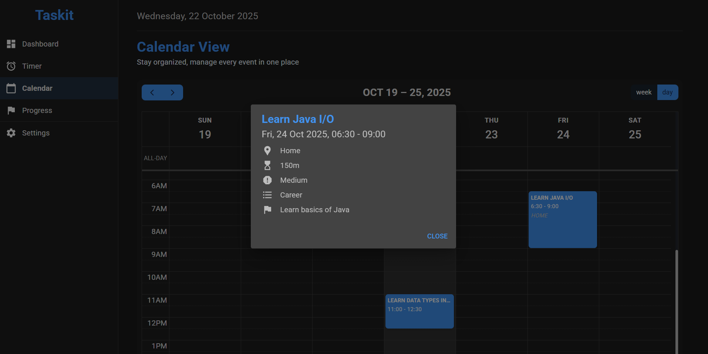

# Taskit — Time Management Dashboard

A lightweight, modern time and task management dashboard built with React. Taskit helps you organize tasks, progress, goals, and your calendar (similar to Google/Proton/Outlook Calendar) with a clean responsive UI, task lists, and a calendar view powered by FullCalendar.

## Table of Contents

- [About](#about)
- [Installation](#installation)
- [Usage](#usage)
- [Features](#features)
- [Tech Stack](#tech-stack)
- [Project Structure](#project-structure)
- [Acknowledgements](#acknowledgements)
- [Contact](#contact)

## About

Taskit is a personal productivity dashboard that combines task management, goals tracking, and a calendar view, with a pomodoro-style timer. It includes features for creating goals, and tasks that align with these goals, lists to categorize the tasks, focus sessions, tracking weekly progress, and viewing tasks in a week/day calendar. The calendar integrates FullCalendar, and the UI is built with Material UI components (MUI).

## Installation

Prerequisites:
- Node.js (16+ recommended)
- npm (or yarn)

Steps:

1. Clone the repository

```bash
git clone https://github.com/msadawi1/task-manager-with-timer-react-web-application.git
cd task-manager-with-timer-react-web-application
```

2. Install dependencies

```bash
npm install
# or
# yarn
```

3. Start the dev server

```bash
npm start
```

4. Build for production

```bash
npm run build
```

Notes:
- If you run into inconsistent dependency issues, remove `node_modules` and regenerate the lockfile:

```bash
rm -rf node_modules package-lock.json
npm install
```

## Usage

- Open the app at `http://localhost:3000` after running the dev server.
- Navigate between the Dashboard, Tasks, Progress, and Calendar views.
- Add goals, tasks and lists in the Dashboard tab.
- Search for tasks using the search bar and the list filter.
- Mark goals or tasks as complete, or delete them.
	- To create a task, you should have at least one goal and at least one list.
	- A task includes: title, goal, list, priority, location (optional), due date, start and end times (optional).
	- Deleting a goal or a list will delete all associated tasks.
	- To mark a goal complete you must complete all of its tasks.
	- Unchecking a task associated with a completed goal is not allowed.
- Navigate to the "Timer" tab and choose a duration to start a pomodoro-style timer focusing on your tasks.
- Click and drag on calendar slots to create tasks using a calendar view.
- Track your progress in the "Progress" tab:
	1. How many tasks you have for the current week
	2. How many have you finished so far
	3. How many tasks are marked as "All Day" tasks
	4. Total time spent on the tasks
	5. Time spent by list
- Progress is tracked using time-per-list (i.e: total time spent on tasks in a particular list, e.g: "Career", "Study", "Gym")
- Add a Reflection in the Progress tab; a reflection is 2-4 sentences describing what you have done during the day and what remains (like a short daily diary).
- You can change theme, timer default duration, and turn on/off web sounds.

**Screenshots**





## Features

- Goal creation (long term achievements you want to make)
- Task creation and lists (to-dos, start and end times, priorities, due dates, category)
- Pomodoro-style timer, with ability to change timer to any duration between 1m-24hrs
- Week/Day calendar view with FullCalendar (like Google/Outlook calendar)
- Weekly progress tracking, track tasks and time spent on each list of tasks.
- Create and delete daily reflections (wrap ups)
- Mobile-friendly interactions and safeguards
- Switch theme between light/dark.
- Choose your favorite timer duration, and turn alerts off/on.
- Material UI-based responsive layout

## Tech Stack

- React 19
- Material UI (MUI)
- FullCalendar (core, interaction, timegrid)
- dayjs for date handling
- framer-motion for animations
- Plain CSS for calendar styling

## Acknowledgements

Special thanks to:

- FullCalendar — calendar UI and interactions
- MUI (Material UI) — component library and theming
- dayjs — date utilities
- framer-motion — UI animations

## Contact

Developer: msadawi1 (me)
Open to connections, check my LinkedIn in bio!
Repository: https://github.com/msadawi1/task-manager-with-timer-react-web-application